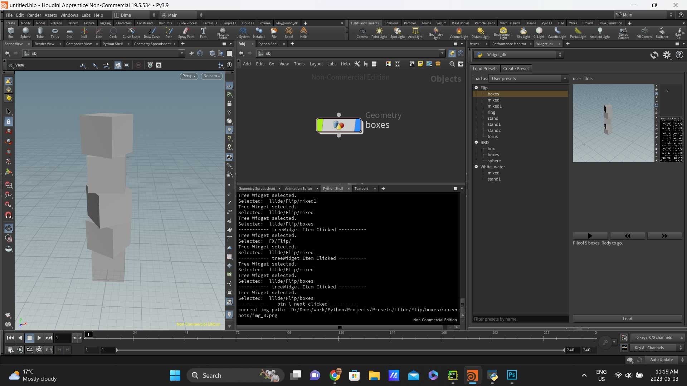
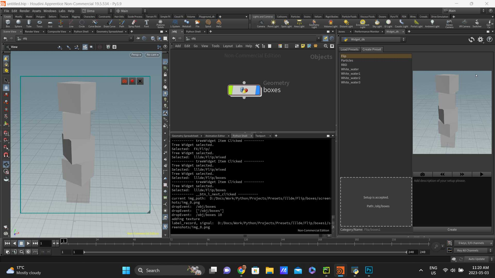
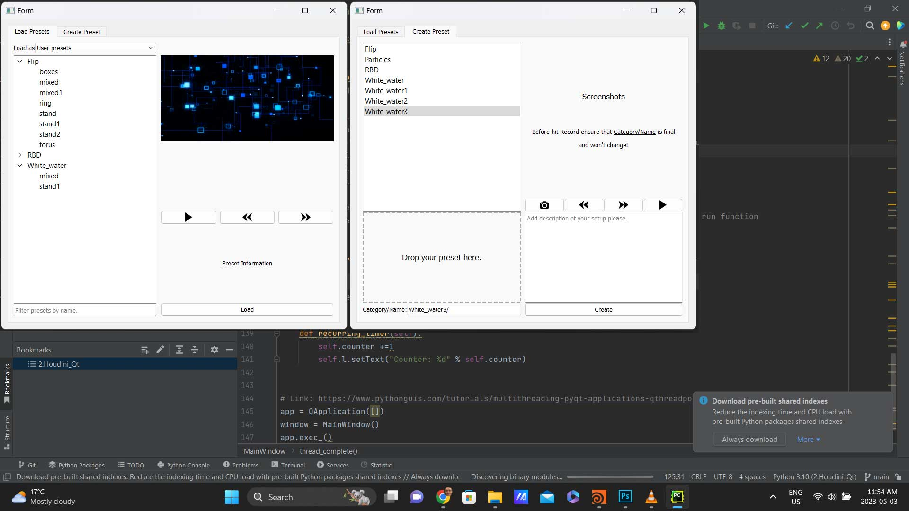
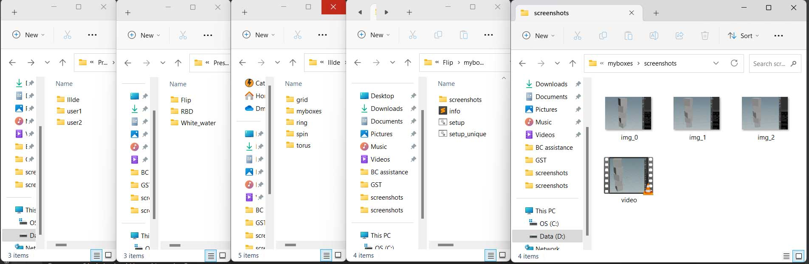
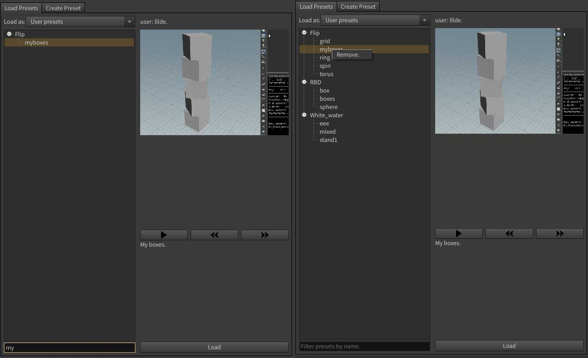
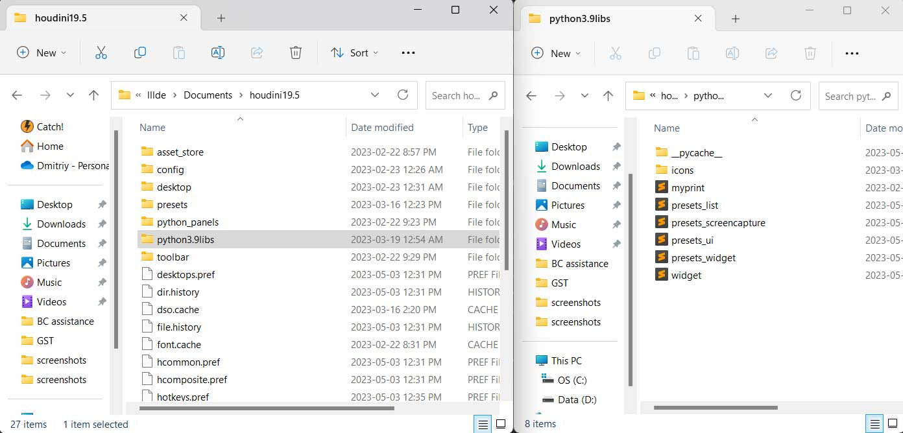
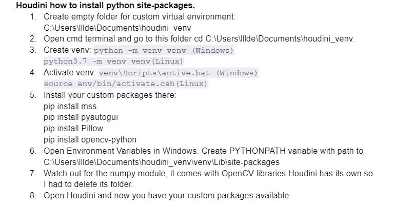
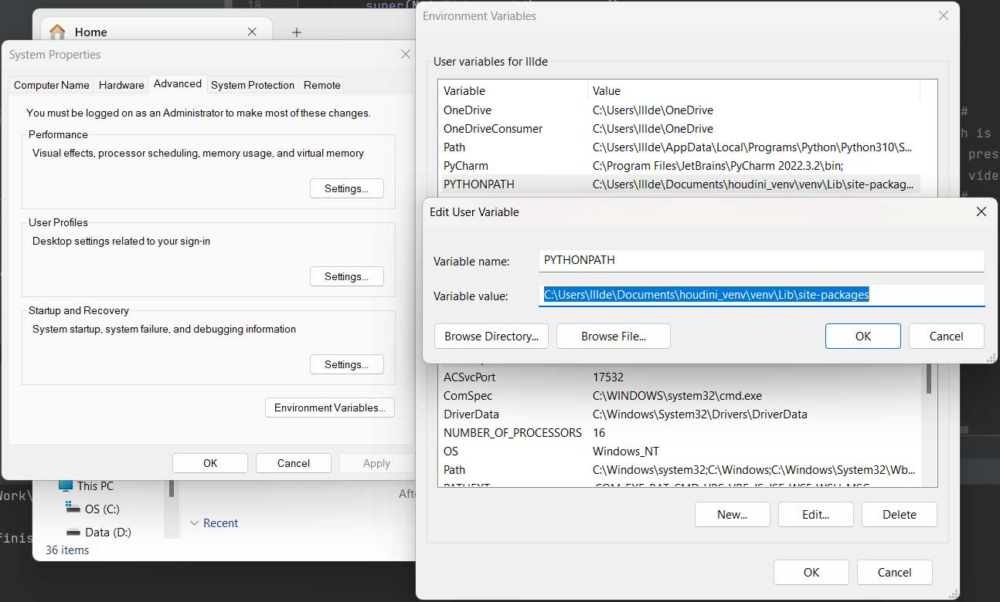
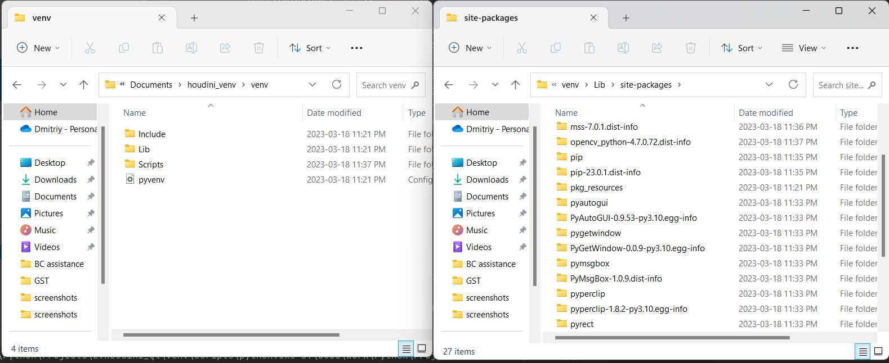
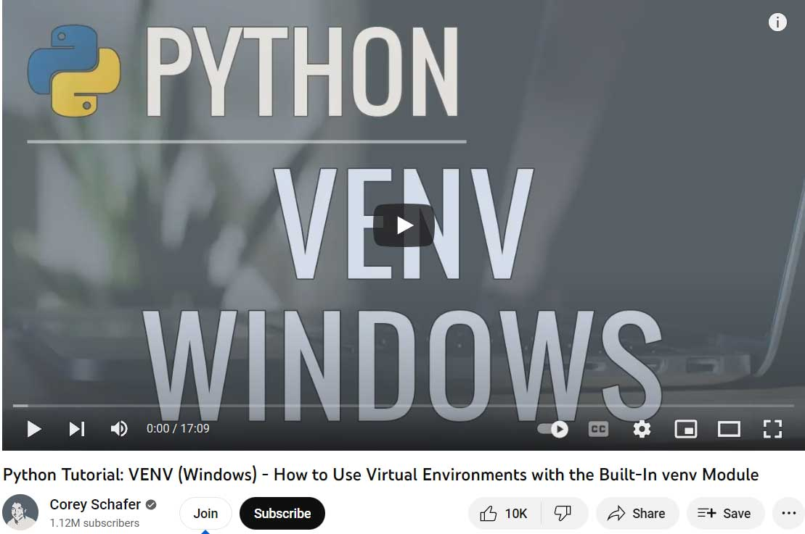

# Houdini Presets Tool.
This tool provides and easy way to store and keep availible any setups you are considering usefull and would like to access them any time in convinient manner. You can drag and drop your setups on any level like Sops, Obj etc, choose a category and name, add discription and create screenshots and video record your screen for best representation of what you've done.

Made in **PyCharm, PySide2, Python 3.9, Houdini 19.5.534**. Installation requires addiditional Python libraries as **pyautogui, Pillow, OpenCV, mss** to be availible through PYTHONPATH if you would like to have access to screencapture features.
## Video preview.

## Screenshots.
### Loading setup interface.

### Adding setup to your library.

### Compiled Qt widgets look.

### Structured data folder.
You will need to modify presets_widget.py to choose your own folder for storing all data structure.  
self.folder = "D:/Docs/Work/Python/Projects/Presets"  
Data structure looks like: Presets_folder/User_folders/Category_folders/Setup_folders/Setup_folder/Screenshots_folder

### Filter setups and Remove features.

## Install.
1. git clone https://github.com/DmoFX/Houdini_Presets_Tool.git .
2. Go to your houdini home directory and create new folder based on your Houdini Python version. I have Houdini 19.5.534 and Python 3.9, so I created  python3.9libs folder.  
You can check Python version in Houdini Help/About/Show Details.  
**Minimum Python requirements: 3+.** 2.7 will produce some Errors.
"C:/Users/lllde/Documents/houdini19.5/python3.9libs/"
3. Copy python files and icons folder into this directory.

4. Open presets_widget.py and modify next paths:  
 ------------------------  UPDATE  THIS INFO  ------------------------------  
        self.libs_path = "C:/Users/lllde/Documents/houdini19.5/python3.9libs/"  # Path is used to load icons.  
        self.folder = "D:/Docs/Work/Python/Projects/Presets"  # Path is used to store presets data on disk.  
        self.vlc_path = "C:/Program Files/VideoLAN/VLC/vlc.exe"  # Direct path to VLC video launcher.  
  ---------------------------------------------------------------------------  
5. In Houdini open Python Panel/New Interface and copy/paste a code from houdini_panel.py. Save it.
6. At this point Presets Tool should work except screen capture features as we didn't install additional Python libraries yet.
7. So now we have to create Python virtual environment and install libs.  

I would highly recommend to watch this video tutorial by Corey Schafer which explain the best how virtual environment works.   

8. Now Houdini should see all additional Python modules and screen capture should work.

